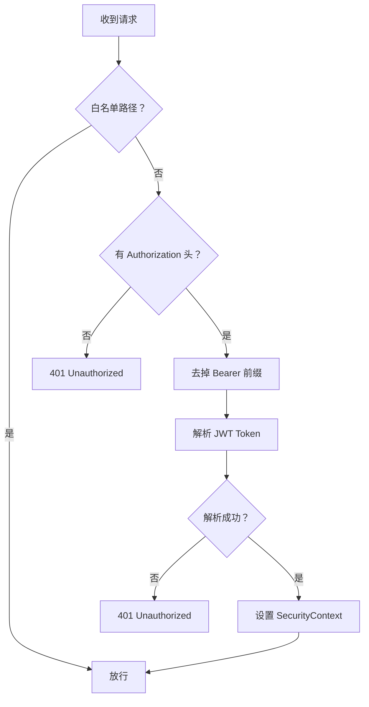

# 🔴 Spring Security 认证与授权

> 对应项目文件：`config/SpringSecurityConfig.java`、`filter/JwtFilter.java`
> 关联笔记：[05-JWT-令牌机制](05-JWT-令牌机制.md) | [01-Spring-Boot-基础](01-Spring-Boot-基础.md)

---

## 一、Spring Security 核心概念

Spring Security 是实现**认证（Authentication）**和**授权（Authorization）**的框架。本项目使用它实现 **JWT 无状态认证**。

```xml
<dependency>
    <groupId>org.springframework.boot</groupId>
    <artifactId>spring-boot-starter-security</artifactId>
</dependency>
```

---

## 二、SecurityFilterChain 配置

```java
@Configuration
@EnableWebSecurity
public class SpringSecurityConfig {

    private final JwtFilter jwtFilter;   // 构造器注入

    public SpringSecurityConfig(JwtFilter jwtFilter) {
        this.jwtFilter = jwtFilter;
    }

    @Bean
    public SecurityFilterChain securityFilterChain(HttpSecurity http) throws Exception {
        return http
            .csrf(csrf -> csrf.disable())   // ① 禁用 CSRF
            .sessionManagement(session ->
                session.sessionCreationPolicy(SessionCreationPolicy.STATELESS))  // ② 无状态
            .authorizeHttpRequests(auth ->
                auth.requestMatchers("/user/login", "/user/register", "/error")
                        .permitAll()      // ③ 白名单
                        .anyRequest().authenticated())  // ④ 其他需认证
            .addFilterBefore(jwtFilter, UsernamePasswordAuthenticationFilter.class)  // ⑤ 自定义过滤器
            .build();
    }
}
```

### ① CSRF 禁用

JWT 模式不使用 Cookie/Session 认证，天然免疫 CSRF 攻击，故可禁用。

### ② 无状态会话策略

```java
SessionCreationPolicy.STATELESS
```

服务端**不存储**用户会话信息，每个请求必须携带完整的 JWT Token。

### ③ 请求权限控制

```java
.requestMatchers("/user/login", "/user/register", "/error").permitAll()
.anyRequest().authenticated()
```

| 方法 | 作用 | 本项目路径 |
|------|------|-----------|
| `permitAll()` | 无需认证 | 注册、登录、错误页 |
| `authenticated()` | 必须登录 | 其他所有接口 |

### ④ 自定义 Filter 插入过滤器链

```java
.addFilterBefore(jwtFilter, UsernamePasswordAuthenticationFilter.class)
```

在 `UsernamePasswordAuthenticationFilter` **之前**执行 `JwtFilter`。

---

## 三、JwtFilter 详解

```java
@Component
public class JwtFilter extends OncePerRequestFilter {
```

### OncePerRequestFilter

确保每个请求只执行一次过滤（普通 Filter 在请求转发时会重复调用）。

### 核心逻辑流程



### SecurityContextHolder

```java
UsernamePasswordAuthenticationToken authentication =
    new UsernamePasswordAuthenticationToken(userName, null, List.of());
SecurityContextHolder.getContext().setAuthentication(authentication);
```

- `SecurityContextHolder` 用 `ThreadLocal` 存储当前请求的认证信息
- 设置后，控制器和 Service 可获取当前用户身份
- 请求处理完毕自动清理

---

## ★ 知识点总结

| 知识点 | 作用 | 源码位置 |
|-------|------|---------|
| `@EnableWebSecurity` | 启用 Security 配置 | `SpringSecurityConfig.java:14` |
| `SecurityFilterChain` | 过滤器链配置 | `SpringSecurityConfig.java:23` |
| `csrf().disable()` | 禁用 CSRF | `SpringSecurityConfig.java:25` |
| `STATELESS` 策略 | 无状态会话 | `SpringSecurityConfig.java:26-27` |
| `permitAll()` | 白名单放行 | `SpringSecurityConfig.java:29` |
| `authenticated()` | 需认证 | `SpringSecurityConfig.java:30` |
| `addFilterBefore()` | 插入过滤器 | `SpringSecurityConfig.java:31` |
| `OncePerRequestFilter` | 每个请求只过滤一次 | `JwtFilter.java:20` |
| `SecurityContextHolder` | 存储认证信息 | `JwtFilter.java:57` |

> 🔗 **下一步学习：** [05-JWT-令牌机制](05-JWT-令牌机制.md) → JWT Token 的生成与验证
