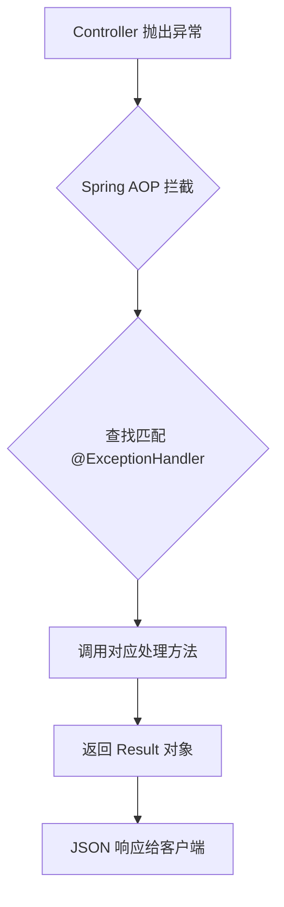

# 🔶 全局异常处理

> 对应项目文件：`exception/` 包下的 8 个异常处理类
> 关联笔记：[[05-JWT-令牌机制]] | [[02-RESTful-API设计]]

---

## 一、@RestControllerAdvice 原理

```java
@RestControllerAdvice
public class GlobalExceptionHandler {
    @ExceptionHandler(Exception.class)
    public Result handleException(Exception e) {
        e.printStackTrace();
        return Result.error("操作失败");
    }
}
```

`@RestControllerAdvice` = `@ControllerAdvice` + `@ResponseBody`

### AOP 工作原理



### @ControllerAdvice vs @RestControllerAdvice

| 注解 | 返回值类型 | 适用场景 |
|------|-----------|---------|
| `@ControllerAdvice` | ModelAndView（视图） | 传统 MVC 页面 |
| `@RestControllerAdvice` | JSON 数据 | RESTful API（本项目） |

---

## 二、全局兜底 vs 特定异常处理

### 全局兜底处理

```java
@ExceptionHandler(Exception.class)
public Result handleException(Exception e) {
    e.printStackTrace();
    return Result.error("操作失败");
}
```

捕获所有未被特定处理器处理的异常，作为最后防线。

### 特定 JWT 异常处理

```java
// 6个 JWT 专项处理器
@ExceptionHandler(ExpiredJwtException.class)         → "Token已过期"
@ExceptionHandler(MalformedJwtException.class)       → "令牌格式错误"
@ExceptionHandler(UnsupportedJwtException.class)     → "不支持的Token格式"
@ExceptionHandler(SignatureException.class)           → "签名错误"
@ExceptionHandler(IllegalArgumentException.class)     → "Token错误"
```

### 异常匹配优先级

Spring 根据异常类型的**继承树最精确匹配**原则选择处理器：

```
ExpiredJwtException → ExpiredJwtExceptionHandler（精确匹配）
其他 Exception → GlobalExceptionHandler（兜底）
```

---

## 三、当前策略分析与优化

### 当前：每异常一个类（8 个类）

**优点：** 职责单一
**缺点：** 大量重复代码，管理成本高

### 优化建议：合并为一个 GlobalExceptionHandler

```java
@RestControllerAdvice
public class GlobalExceptionHandler {

    @ExceptionHandler(ExpiredJwtException.class)
    public Result handleExpiredJwt(ExpiredJwtException e) {
        return Result.error("Token已过期: " + e.getMessage());
    }

    @ExceptionHandler(MalformedJwtException.class)
    public Result handleMalformedJwt(MalformedJwtException e) {
        return Result.error("令牌格式错误: " + e.getMessage());
    }

    @ExceptionHandler(Exception.class)
    public Result handleException(Exception e) {
        e.printStackTrace();
        return Result.error("操作失败");
    }
}
```

将所有 `@ExceptionHandler` 合并到一个类中，代码更精简。

---

## ★ 知识点总结

| 知识点 | 作用 | 源码位置 |
|-------|------|---------|
| `@RestControllerAdvice` | 全局异常拦截 + JSON 响应 | 所有 `exception/*.java` |
| `@ExceptionHandler` | 指定处理的异常类型 | 所有 `exception/*.java` |
| `Exception.class` | 兜底所有未指定异常 | `GlobalExceptionHandler.java:16` |
| JWT 专项异常 | 精确的用户提示信息 | 6 个 JWT 处理器 |

> 🔗 **下一步学习：** [[09-密码加密与安全]] → 密码存储安全机制
